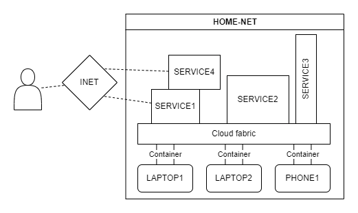

# Flex cloud
> Exploring approaches for building a private and personal self-hosted cloud. Independent and flexible power anywhere.

## In progress
- Exploring and researching existing software solutions
- Finding best fit solution for project
- Researching possibility and needs of own software solution.

The goal of the project is to find and create asolution that servers as the central unit in my developer environment. This means capabilities to freely run workloads, store data, database support, host servers, run VMs, run containers, etc.

The project is partly about craeting a super-flexible and portable environment where all i need is a laptop and internet connection to varying degrees of expensive computational/hosting work.

Lastly, the project aims to explore usecases for older and unused hardware.

## Currently available machines
- 2x Lenovo ThinkPad x380 Yoga
- 1x Lenovo L15
- 1x Lenovo flex 14 w. 840m
- 1x Huawei matebook 13 w. MX150
- Ensemble of phones

## Requirements.txt
- Run containers
- Storage
- Azure functions/AWS lambda like functionality
- Webserver hosting
- Database support
- V-Net support
- Flexibility
- Lightweight
- Apache Spark support

## The ideal solution
Container-based cloud fabric for highest flexibility. Freely add and remove nodes as needed.

Deploying VMs or ideally containers on top of cloud fabric.

# Complete solutions
Existing complete solutions. Private cloud software. Full functionality out of the box.

## Apache CloudStack
[Website](https://cloudstack.apache.org/) | [GitHub](https://github.com/apache/cloudstack)

Apache CloudStack is an open source Infrastructure-as-a-Service platform that manages and orchestrates pools of storage, network, and computer resources to build a public or private IaaS compute cloud [1].

Minimal setup with one machine running *CloudStack Management Server* and another machine as the *cloud infrastructure*.

Easy management through web-interface.

Hosts as smallest level of grain. 

Running guest VMs.

[Cloudstack CaaS](https://www.shapeblue.com/cloudstack-container-service/)

## OpenNebula
[Website](https://opennebula.io/) | [GitHub](https://github.com/OpenNebula/one) | [Docs](https://docs.opennebula.io/)

"OpenNebula is a simple, yet powerful and flexible turnkey open source solution to build Private Clouds and manage Data Center virtualization on KVM [2]."

"OpenNebula is a powerful, but easy to use, open source solution to build and manage Enterprise Clouds."

"Combine containerized applications from Kubernetes and Docker Hub ecosystems with Virtual Machine workloads in a common shared environment..."

Great fit for the projects needs.

## OpenStack
[Website](https://www.openstack.org/) | [OpenDev](https://opendev.org/openstack) | [GitHub Mirrors](https://github.com/orgs/openstack/repositories)

"OpenStack is a set of software components that provide common services for cloud infrastructure [3]."

"Openstack controls large pools of compute, storage, and networking resources, all managed through APIs or a dashboard."

"Beyond standard infrastructure-as-a-service functionality, additional components provide orchestration, fault management and service management..."

"OpenStack is broken up into services to allow you to plug and play components depending on your needs."

Also seems like a great fit for project.

"The target audience is someone new to cloud computing that is kicking the tires on a small number of servers in a basement or back room." on the Compute Starter Kit. 

All the different components could prove troublesome in terms of confoguration and setup, rabbit hole and loads of places for misconfiguration.¨

## Apache Mesos
[Website](https://mesos.apache.org/) | [GitHub](https://github.com/apache/mesos)

"Program against your datacenter like it’s a single pool of resources [4]."

"Apache Mesos abstracts CPU, memory, storage, and other compute resources away from machines (physical or virtual), enabling fault-tolerant and elastic distributed systems to easily be built and run effectively."

"Mesos is built using the same principles as the Linux kernel, only at a different level of abstraction The Mesos kernel runs on every machine and provides applications (e.g., Hadoop, Spark, Kafka, Elasticsearch) with API’s for resource management and scheduling across entire datacenter and cloud environments."

"Native support for launching containers with Docker and AppC images."

Solves problems of running multiple cluster computing frameworks on the same machine/in the same cluster.

## Eucalyptus Cloud
[website](https://www.eucalyptus.cloud/) | [GitHub](https://github.com/Corymbia/eucalyptus)

Lorem ipsum dolor sit amet

## AppScale
[Website](https://www.appscale.com/) | [GitHub](https://github.com/AppScale)

Lorem ipsum dolor sit amet

## SealOS
[SealOS](https://github.com/labring/sealos)

OS based on kubernetes. "..only be cloud OS drivers, cloud OS kernel and distributed applications." 

OCI compatible distributed applications (PostgreSQL, MySQL, Redis, etc.).

use Dockerfiles to build distributed applications images.

# Partial solutions
Building the platform from different services fulfilling individual needs. For example setting up a distributed service for database, another for server management and another for distributed compute on each machine.

A domain I have little familiarity with. Maybe clustering though Kubernetes will work as well.

## OHPC
[GitHub](https://github.com/openhpc/ohpc)

Lorem ipsum dolor sit amet

## Kubernetes
- https://betterprogramming.pub/build-your-own-multi-node-kubernetes-cluster-with-monitoring-346a7e2ef6e2
- https://tsuru.io/ | https://github.com/tsuru
- https://www.okd.io/ | https://github.com/openshift
- https://www.cloudfoundry.org/ | https://github.com/cloudfoundry

## Distributed databases
Lorem ipsum dolor sit amet

### Apache spark
Lorem ipsum dolor sit amet

# DIY
If all else fails I am committed to trying to build a semi functional cloud fabric service from scratch. Most likely in Rust. The idea (if it eer gets to it) would be to build a simple container manager, meaning all work is done throgh containers and meaning the needed setup file for each contaienr would be a dockerfile sent over the network before being deployed to the "cloud" machines.

# Sources
- [1] CloudStack Docs. https://docs.cloudstack.apache.org/en/latest.
- [2] OpenNebula Docs. https://docs.opennebula.io/6.4/.
- [3] OpenStack Docs. https://docs.openstack.org/zed/.
- [4] Apache Mesos. https://mesos.apache.org/.
- T. Kurek. "Open-source cloud for beginners with OpenStack". Ubuntu. https://ubuntu.com/blog/open-source-cloud.
- K. john. "Top Open Source Cloud Platforms and Solutions". Computing for geeks. https://computingforgeeks.com/top-open-source-cloud-platforms-and-solutions/
- B. Hindman, A. konwinski, M. Zaharia, A. Ghodsi, D, Joseph, R. katz, S. Schenker, I. Stoica. Mesos. Mesos: A Platform for Fine-Grained Resource Sharing in the Data Center. https://people.eecs.berkeley.edu/~alig/papers/mesos.pdf.